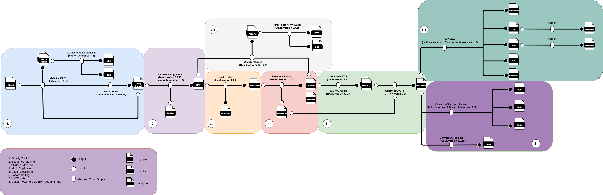

# nextflow-Callvariants

## หัวข้อ
1. [บทนำ](#1-บทนำ)
2. [การใช้งาน nextflow-Callvariants](#2-การใช้งาน-nextflow-Callvariants)
3. [การเตรียมเครื่องมือและข้อมูลสำหรับ nextflow-Callvariants](#3-การเตรียมเครื่องมือและข้อมูลสำหรับ-nextflow-Callvariants)
4. [รายละเอียดขั้นตอนใน nextflow-Callvariants](#4-รายละเอียดขั้นตอนใน-nextflow-Callvariants)
5. [การปรับแต่งการ Annotations ใน VEP](#5-การปรับแต่งการ-Annotations-ใน-VEP)
6. [Output](#6-Output)

---

## 1. บทนำ
nextflow-vep เป็น bioinformatics pipline ที่พัฒนาขึ้นสำหรับการทำ Variants Calling โดยจะมีขั้นตอนดังต่อไปนี้ 
1. Quality Control
2. Sequence Alignment
3. Quality Mapped
4. Mark Duplicates
5. Base Recalibrate
6. Variants Calling
7. VCF stats
8. Convert VCF to BED,BIM,FAM and hmp

