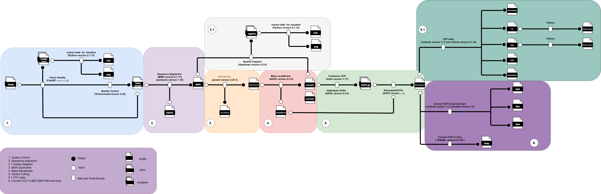

# nextflow-Callvariants

## หัวข้อ
1. [บทนำ](#1-บทนำ)
2. [การใช้งาน nextflow-Callvariants](#2-การใช้งาน-nextflow-Callvariants)
3. [การเตรียมเครื่องมือและข้อมูลสำหรับ nextflow-Callvariants](#3-การเตรียมเครื่องมือและข้อมูลสำหรับ-nextflow-Callvariants)
4. [รายละเอียดขั้นตอนใน nextflow-Callvariants](#4-รายละเอียดขั้นตอนใน-nextflow-Callvariants)
5. [Output](#5-Output)

---

## 1. บทนำ
Nextflow-Callvariants เป็น bioinformatics pipline ที่พัฒนาขึ้นสำหรับการทำ Variants Calling โดยจะมีขั้นตอนดังต่อไปนี้ 
1. Quality Control
2. Sequence Alignment
3. Callvariant
4. MultiQC
5. Postprocess




## 2. การใช้งาน nextflow-Callvariants
### การใช้งานอย่างง่าย
```bash
nextflow run main.nf -profile gb --input <path-input> --reads_type SE --reference ref_fasta_IRGSP-1.0 --output <path-output>
```
### การใช้งานแบบเต็มรูปแบบ
```bash
nextflow run main.nf -profile gb --input <path-input> \
                                 --phred 20 \
                                 --minlen 50 \
                                 --reads_type SE \
                                 --reference ref_fasta_IRGSP-1.0 \
                                 --vcfknowsite on \
                                 --mapQ 30 \
                                 --window_size 5000000 \
                                 --bi_allelic filter \
                                 --export \
                                 --output <path-output>
```

### Options
#### Input and Ouput Options
- `--input` = โฟลเดอร์ input (จำเป็น)
- `--output` = โฟล์เดอร์ output (จำเป็น)
#### QC Options
- `--phred` =  ค่า phred score สำหรับขั้นตอน Quality Control (ค่าเริ่มต้น:20 | 0-100)
- `--minlen` = จำนวน reads ที่สั้นที่สุดที่ยอมรับได้สำหรับขั้นตอน Quality Control (ค่าเริ่มต้น:50 | 5-300)
- `--reads_type` = ชนิดของ reads [SE, PE|ค่าเริ่มต้น:PE]
#### Alignment Options
- `--reference` = reference ที่ต้องการทำ Alignment และ Variants Calling ["ref_fasta_ja", "ref_fasta_in", "ref_fasta_Mesculenta","ref_fasta_Zmays", "ref_fasta_Slycopersicum", "ref_fasta_Cannuum", "ref_fasta_ChineseLong", "ref_fasta_Gy14", "ref_fasta_IRGSP-1.0", "ref_fasta_ASM465v1", "ref_fasta_Cmaxima", "ref_fasta_Cmoschata","ref_fasta_Cpepo"] (จำเป็น)
- `--vcfknowsite` = ใช้  vcf สำหรับการทำ recalibrator หรือไม่  (on, off | ค่าเริ่มต้น: on)
- `--mapQ` = mapping Quality สำหรับการ alingment (ค่าเริ่มต้น:30 | 0-60 )
#### Callvariant Options
- `--window_size` = window size สำหรับการวม gvcf เพื่อสร้างไฟล์ vcf (ค่าเริ่มต้น:5000000 | 100000 - 10000000 )
#### Postprocess Options
- `--bi_allelic` = กรอง bi allelic snps  (filter,non-filter | ค่าเรื่มต้น: filter)
- `--export` = convert ไฟล์ vcf สู่รูปแบบข้อมูลอื่นๆ (hmp, bedbimfam, both | ค่าเริ่มต้น: both)

## 3. การเตรียมเครื่องมือและข้อมูลสำหรับ nextflow-Callvariants
### เครืองมือ 
Nextflow: version 24
1. Quality Control
   - FastQC version 0.11.9
   - Trimmomatric version 0.38
2. Sequence Alignment
   - BWA version 0.7.17
   - samtools version 1.18
   - Picard version 2.25.1
   - Qualimap version 2.3
   - GATK version 4.5.0
3. Callvariant
   - GATK version 4.5.0
   - htsib version 1.19.1
4. MultiQC
   - MultiQC verion 1.33
5. Postprocess
   - VCFtools version 0.1.16
   - BCFtools version 1.17
   - PLINK version 1.9b
   - BCFtools version 1.17
   - TASSEL version 5.2.59
   - Python version 3.10.4
     
### การเตรียม Config
ผู้ใช้งานสามารปรับแต่งเครื่องมือที่ใช้งานในไฟล์ gb.config ให้เหมาะสมกับทรัพยากรในเครื่อง โดย gb.config จะทำงานรวมกับ nextflow.config โดยจะใช้ตัวเลือก `-profile` เพื่อเลือก config ที่จะใช้งาน
```
process {
  executor = 'slurm'
  queue = 'memory'
  cache = 'lenient'

  withName: Trimmmomatic_Single {
    module = 'Trimmomatic/0.38-Java-1.8'
    cpus = 8
    memory = '64 GB'
  }

  withName: Trimmmomatic_Paired {
    module = 'Trimmomatic/0.38-Java-1.8'
    cpus = 8
    memory = '64 GB'
  }

  withName: FastqcForSingleBefore {
    beforeScript = 'export PATH=$HOME/tools/FastQC:$PATH'
    cpus = 4
    memory = '8 GB'
  }

  withName: FastqcForSingleAfter {
    beforeScript = 'export PATH=$HOME/tools/FastQC:$PATH'
    cpus = 4
    memory = '8 GB'
  }

  withName: FastqcForPairedBefore {
    module = 'FastQC/0.11.9-Java-11'
    cpus = 8
    memory = '64 GB'

  }

  withName: FastqcForPairedAfter {
    module = 'FastQC/0.11.9-Java-11'
    cpus = 8
    memory = '64 GB'
  }

  withName: AlignmentSingle {
    module = 'BWA/0.7.17-GCCcore-11.2.0:SAMtools/1.18-GCC-12.3.0:picard/2.25.1-Java-11:'
    cpus = 8
    memory = '64 GB'
  }

  withName: AlignmentPaired {
    module = 'BWA/0.7.17-GCCcore-11.2.0:SAMtools/1.18-GCC-12.3.0:picard/2.25.1-Java-11:'
    cpus = 8
    memory = '64 GB'
  }

  withName: Mark_duplicates {
  module = 'Java/11.0.16:picard/2.25.1-Java-11'
  cpus = 4
  memory = '32 GB'
  }

  withName: Base_recalibrator {
  module = 'GATK/4.5.0-java-17'
  cpus = 8
  memory = '64 GB'
  }

  withName: Call_GVCF {
  module = 'GATK/4.5.0-java-17:HTSlib/1.19.1-GCC-12.3.0'
  cpus = 10
  memory = '96 GB'
  }

  withName: GenomicsDBImport {
  module = 'GATK/4.5.0-java-17'
  cpus = 10
  memory = '96 GB'
  }

  withName: GenotypeGVCFs {
  module = 'GATK/4.5.0-java-17'
  cpus = 10
  memory = '96 GB'
  }

  withName: Combine_finalVCF {
  module = 'GATK/4.5.0-java-17'
  cpus = 10
  memory = '96 GB'
  }

  withName: VcftoBed {
  module = 'BCFtools/1.17-GCC-12.2.0:PLINK/1.9b_4.1-x86_64:TASSEL/5.2.59'
  cpus = 16
  memory = '128 GB'
  }

  withName: VCFtoVCFbi {
  module = 'BCFtools/1.17-GCC-12.2.0'
  cpus = 16
  memory = '128 GB'
  }

  withName: VCFtoHMP {
  module = 'TASSEL/5.2.59'
  cpus = 16
  memory = '128 GB'
  }

  withName: VCFtoBEDBIMFAM {
  module = 'PLINK/1.9b_4.1-x86_64'
  cpus = 4
  memory = '8 GB'
  }

  withName: Qualimap {
  container = '/nbt_main/share/singularity/qualimap:2.3--hdfd78af_0'
  cpus = 4
  memory = '8 GB'
  }


  withName: MultiQC {
  beforeScript = 'export PATH=$HOME/.local/bin/:$PATH'
  cpus = 4
  memory = '8 GB'
  }

  withName: VCFtoolsBefore_stats {
  module = 'VCFtools/0.1.16-GCC-11.3.0'
  cpus = 8
  memory = '16 GB'
  }

  withName: VCFtoolsAfter_stats {
  module = 'VCFtools/0.1.16-GCC-11.3.0'
  cpus = 8
  memory = '16 GB'
  }

  withName: BCFtoolsBefore_stats {
  module = 'BCFtools/1.17-GCC-12.2.0'
  cpus = 8
  memory = '16 GB'
  }

  withName: BCFtoolsAfter_stats {
  module = 'BCFtools/1.17-GCC-12.2.0'
  cpus = 8
  memory = '16 GB'
  }

  withName: HistogramBefore {
  module = 'Python/3.10.4-GCCcore-11.3.0'
  cpus = 8
  memory = '16 GB'
  }

  withName: HistogramAfter {
  module = 'Python/3.10.4-GCCcore-11.3.0'
  cpus = 8
  memory = '16 GB'
  }

}

singularity {
    enabled = true
    autoMounts = true
}

```
 
## 4. รายละเอียดขั้นตอนใน-nextflow-Callvariants
### Quality Control
เครื่องมือชีวสารสนเทศในการทำ Quality Control ได้แก่ Trimmomatric (version 0.38) โดยทำการปรับแต่งข้อมูล `--phred` และ `--minlen` ตามที่ผู้ใช้ต้องการ และใช้ FastQC (version 0.11.9) ในการแสดงผลข้อมูลก่อนและหลังปรับแต่งคุณภาพของข้อมูล
```bash
process Trimmmomatic_Paired {

  tag { "${fileId}" }

  publishDir "${outputPrefixPath(params, task)}"

  input:
  tuple val(fileId), file(read1), file(read2)

  output:
  tuple val(fileId), file("${prefix}_R1_trimmed.fastq.gz"), file("${prefix}_R2_trimmed.fastq.gz")

  script:
  prefix=fileId

  """
  java -jar \$EBROOTTRIMMOMATIC/trimmomatic-0.38.jar PE -phred33 -threads ${task.cpus} \
  ${read1} ${read2} \
  ${prefix}_R1_trimmed.fastq.gz ${prefix}_R1_untrimmed.fastq.gz \
  ${prefix}_R2_trimmed.fastq.gz ${prefix}_R2_untrimmed.fastq.gz \
  ILLUMINACLIP:${params.adapterFiles}:2:30:10 \
  LEADING:${params.phred} TRAILING:${params.phred} \
  SLIDINGWINDOW:4:20 MINLEN:${params.minlen}
  """
}
```
```bash
process Trimmmomatic_Single {

  tag { "${fileId}" }

  publishDir "${outputPrefixPath(params, task)}"

  input:
  tuple val(fileId), file(reads)

  output:
  tuple val(fileId), file("${prefix}_trimmed.fastq.gz")

  script:
  prefix=fileId

  """
  java -jar \$EBROOTTRIMMOMATIC/trimmomatic-0.38.jar SE -phred33 -threads ${task.cpus} \
  ${reads} \
  ${prefix}_trimmed.fastq.gz \
  ILLUMINACLIP:${params.adapterFiles}:2:30:10 \
  LEADING:${params.phred} TRAILING:${params.phred} \
  SLIDINGWINDOW:4:20 MINLEN:${params.minlen}
  """
}
```
```bash
process FastqcForPaired {

  tag { key }
  publishDir "${outputPrefixPath(params, task)}"

  input:
  tuple val(key), file(reads1), file(reads2)

  output:
  tuple val(key), file("*.zip"), file("*.html")

  script:
  """
  fastqc ${reads1} ${reads2} --threads 8
  """
}

```
```bash
process FastqcForSingle {

  tag { key }
  publishDir "${outputPrefixPath(params, task)}"

  input:
  tuple val(key), file(reads)

  output:
  tuple val(key), file("*.zip"), file("*.html")

  script:
  """
  fastqc --threads 8 ${reads}
  """
}
```
```bash
process FastqcForSingle_visualize {


  publishDir "${outputPrefixPath(params, task)}"

  input:
  path zip_qc

  output:
  path "fastqc_summary.csv"

  script:

  """
  for file in *.zip; do unzip -o "\$file" -d extracted/; done
  echo "sameple_name,Total_Sequences_BeforeQC,Total_Sequences_AfterQC,Sequence_length_BeforeQC,Sequence_length_AfterQC,%GC_BeforeQC,%GC_AfterQC" > fastqc_summary.csv
  declare -A before_qc after_qc

  for file in extracted/*/fastqc_data.txt; do
      filename=\$(grep "Filename" "\$file" | cut -f2)
      total_sequences=\$(grep "Total Sequences" "\$file" | cut -f2)
      seq_length=\$(grep "Sequence length" "\$file" | cut -f2)
      gc_content=\$(grep "%GC" "\$file" | cut -f2)

      base_name=\$(echo "\$filename" | sed -E 's/_R?[12]//; s/_trimmed//; s/_q20\\.cutadap//; s/(\\.fastq)?\\.gz\$//')

      if [[ "\${filename}" == *trimmed* ]]; then
           after_qc["\$base_name"]="\$total_sequences,\$seq_length,\$gc_content"
      else
           before_qc["\$base_name"]="\$total_sequences,\$seq_length,\$gc_content"
      fi

  done

  all_keys=(\$(printf "%s\n" "\${!before_qc[@]}" "\${!after_qc[@]}" | sort -u))

  for key in "\${all_keys[@]}"; do
      before="\${before_qc[\$key]:-,,}"
      after="\${after_qc[\$key]:-,,}"

      before_total_sequences=\$(echo \$before | cut -d',' -f1)
      before_seq_length=\$(echo \$before | cut -d',' -f2)
      before_gc_content=\$(echo \$before | cut -d',' -f3)

      after_total_sequences=\$(echo \$after | cut -d',' -f1)
      after_seq_length=\$(echo \$after | cut -d',' -f2)
      after_gc_content=\$(echo \$after | cut -d',' -f3)

      echo "\$key,\$before_total_sequences,\$after_total_sequences,\$before_seq_length,\$after_seq_length,\$before_gc_content,\$after_gc_content" >> fastqc_summary.csv

 done
 """
}
```
```bash
process FastqcForPaired_visualize {

  publishDir "${outputPrefixPath(params, task)}"

  input:
  path zip_qc

  output:
  path "fastqc_summary.csv"

  script:

  """
  for file in *.zip; do unzip -o "\$file" -d extracted/; done
  echo "sameple_name,ReadPair,Total_Sequences_BeforeQC,Total_Sequences_AfterQC,Sequence_length_BeforeQC,Sequence_length_AfterQC,%GC_BeforeQC,%GC_AfterQC" > fastqc_summary.csv
  declare -A before_qc after_qc

  for file in extracted/*/fastqc_data.txt; do
      filename=\$(grep "Filename" "\$file" | cut -f2)
      total_sequences=\$(grep "Total Sequences" "\$file" | cut -f2)
      seq_length=\$(grep "Sequence length" "\$file" | cut -f2)
      gc_content=\$(grep "%GC" "\$file" | cut -f2)

      base_name=\$(echo "\$filename" | sed -E 's/_R?[12]//; s/_trimmed//; s/_q20\\.cutadap//; s/(\\.fastq)?\\.gz\$//')
      read_pair=\$(echo "\$filename" | grep -oE "_R?[12]" | sed 's/_//')
      [[ -z "\$read_pair" ]] && read_pair="R?"

      key="\${base_name}_\${read_pair}"

      if [[ "\${filename}" == *trimmed* ]]; then
           after_qc["\$key"]="\$total_sequences,\$seq_length,\$gc_content"
           echo ">>> AFTER_QC[\$key] = \${after_qc[\$key]}"
      else
           before_qc["\$key"]="\$total_sequences,\$seq_length,\$gc_content"
           echo ">>> BEFORE_QC[\$key] = \${before_qc[\$key]}"
      fi

  done

  all_samples=(\$(printf "%s\n" "\${!before_qc[@]}" "\${!after_qc[@]}" | sed -E 's/_(R[12])\$//' | sort -u))

  for sample in "\${all_samples[@]}"; do
      for read_pair in R1 R2; do
          key="\${sample}_\${read_pair}"

          before="\${before_qc[\$key]:-,,}"
          after="\${after_qc[\$key]:-,,}"

          before_total_sequences=\$(echo \$before | cut -d',' -f1)
          before_seq_length=\$(echo \$before | cut -d',' -f2)
          before_gc_content=\$(echo \$before | cut -d',' -f3)

          after_total_sequences=\$(echo \$after | cut -d',' -f1)
          after_seq_length=\$(echo \$after | cut -d',' -f2)
          after_gc_content=\$(echo \$after | cut -d',' -f3)

          echo "\$sample,\$read_pair,\$before_total_sequences,\$after_total_sequences,\$before_seq_length,\$after_seq_length,\$before_gc_content,\$after_gc_content" >> fastqc_summary.csv
      done
  done
  """
}
```

### Sequence Alignment
เครื่องมือชีวสารสนเทศในการทำ Sequence Alignment ได้แก่ BWA (version 0.7.17) ในการ Alignment ตาม `--reference` ที่ผู้ใช้งานเลือกแล้วจึงทำการการแปลงไฟล์ sam เป็นไฟล์ bam และกรอง read ด้วย `--mapQ` ตามที่ผู้ใช้งานกำหนดด้วย samtools (version 1.18) และทำการจัดเรียงข้อมุลด้วย Picard (version 2.25.1)
```bash
process AlignmentSingle {

  tag { "${fileId}" }

  publishDir "${outputPrefixPath(params, task)}"

  input:
  tuple val(fileId), file(read1)

  output:
  tuple val(fileId), file("${fileId}.aln.sorted.bam")

  script:
  prefix = fileId

  """
  bwa mem -t 8 -R "@RG\\tID:${fileId}\\tLB:lib1\\tPL:illumina\\tSM:${prefix}\\tPU:unit1" -M ${params.reference} ${read1} | \

  samtools view -bS -@ 8 - | samtools view -q ${params.mapQ} -b | \

  java -XX:ParallelGCThreads=8 -jar \$EBROOTPICARD/picard.jar SortSam I=/dev/stdin O=${fileId}.aln.sorted.bam SORT_ORDER=coordinate

  """
}
```
```bash
process AlignmentPaired {

  tag { "${fileId}" }

  publishDir "${outputPrefixPath(params, task)}"

  input:
  tuple val(fileId), file(read1), file(read2)

  output:
  tuple val(fileId), file("${fileId}.aln.sorted.bam")
  
  script:
  prefix = fileId
  
  """
  bwa mem -t 8 -R "@RG\\tID:${fileId}\\tLB:lib1\\tPL:illumina\\tSM:${prefix}\\tPU:unit1" -M ${params.reference} ${read1} ${read2} | \
  
  samtools view -bS -@ 8 - | samtools view -q ${params.mapQ} -b | \

  java -XX:ParallelGCThreads=8 -jar \$EBROOTPICARD/picard.jar SortSam I=/dev/stdin O=${fileId}.aln.sorted.bam SORT_ORDER=coordinate
   
  """
}
```
เครื่องมือชีวสารสนเทศในการทำ Mark Duplicates ได้แก่ Picard (version 2.25.1)
```bash
process Mark_duplicates {

  tag { "${fileId}" }

  publishDir "${outputPrefixPath(params, task)}"

  input:
  tuple val(fileId), file(sortbam)

  output:
  tuple val(fileId), file("${prefix}.aln.sorted.mrkDup.bam")
  tuple val(fileId), file("${prefix}.dup_metrics.txt")

  script:
  prefix=sortbam.simpleName
  
  """
  java -XX:ParallelGCThreads=8 -Djava.io.tmpdir=java_temps -jar \$EBROOTPICARD/picard.jar MarkDuplicates I=${sortbam} O=${prefix}.aln.sorted.mrkDup.bam METRICS_FILE=${prefix}.dup_metrics.txt CREATE_INDEX=true
  """
}
```
เครื่องมือชีวสารสนเทศในการทำ Base Recalibrate ได้แก่ GATK (version 4.5.0) สำหรับขั้นตอนนี้หากผู้ใช้งานไม่มีไฟล์ VCF สามารถใช้งาน `--vcfknowsite off` ได้ เพื่อข้ามขั้นตอนนี้ไป
```bash
process Base_recalibrator {

  tag { "${fileId}" }

  publishDir "${outputPrefixPath(params, task)}"

  input:
  tuple val(fileId), file(markDup)

  output:
  tuple val(fileId), file("${prefix}.recal.bam")

  script:
  prefix=markDup.simpleName

  """
  gatk --java-options "-Xmx16G" BaseRecalibrator -R ${params.reference} -I ${markDup} -known-sites ${params.knownsite} -O ${prefix}.recal.table

  gatk --java-options "-Xmx16G" ApplyBQSR -R ${params.reference} -I ${markDup} --bqsr-recal-file ${prefix}.recal.table -O "${prefix}.recal.bam"
  """
}
```
เครื่องมือชีวสารสนเทศในการทำแสดงผลในส่วน Quality Mapped ได้แก่ Qualimap version 2.3 ในการตรวจสอบคุณภาพในการ Mapped จากขั้นตอน Sequence Alignment
```bash
process Qualimap {

  tag { prefix }
  publishDir "${outputPrefixPath(params, task)}"

  input:
  tuple val(key), file(bam)

  output:
  file "*"

  script:
  prefix=bam.baseName

  """
  qualimap bamqc -bam ${bam}
  """
}
```
```bash
process Qualimap_visualize {

  publishDir "${outputPrefixPath(params, task)}"

  input:
  path qmap

  output:
  path "*"

  script:

  """
  echo "filename,number_of_reads,number_of_mapped_reads,percent_of_mapped_reads,percent_of_unmapped_reads,mean_coverage_x,sd_coverage_x,duplication_rate" > qualimap_summary.csv

  for dir in *_stats; do
      file="\$dir/genome_results.txt"
      if [[ -f "\$file" ]]; then
         name=\${dir%%[_\\.]*}
         total_reads=\$(grep "number of reads =" "\$file" | awk '{print \$NF}' | tr -d ',')
         mapped_reads=\$(grep "number of mapped reads =" "\$file" | awk '{print \$(NF-1)}' | tr -d ',')
         mapped_percent=\$(grep "number of mapped reads =" "\$file" | awk -F '[()]' '{print \$2}' | tr -d '%')
         unmapped_percent=\$(awk -v mp="\$mapped_percent" 'BEGIN {printf "%.2f", 100 - mp}')
         mean_coverage=\$(grep "mean coverageData" "\$file" | awk '{print \$NF}' | sed 's/X//')
         std_coverage=\$(grep "std coverageData" "\$file" | awk '{print \$NF}' | sed 's/X//')
         duplication_rate=\$(grep "number of duplicated reads" "\$file" | awk '{print \$NF}' | tr -d '%')

         echo "\$name,\$total_reads,\$mapped_reads,\$mapped_percent,\$unmapped_percent,\$mean_coverage,\$std_coverage,\$duplication_rate" >> qualimap_summary.csv
      fi
  done
  """
}
```
### Callvariant
เครื่องมือชีวสารสนเทศในการทำ HaplotypeCaller, GenomicsDBImport, GenotypeGVCFs และ การรวมไฟล์ ได้แก่ GATK (version 4.5.0) โดยการทำ HaplotypeCaller และใช้ GenomicsDBImport ในการสร้าง databases สำหรับการทำ GenotypeGVCFs โดยจะแบ่งช่วง reads ตาม `--window_size` ที่ผู้ใช้ต้องการจากนั้นจึงทำการรวมไฟล์ VCF ที่ได้ไว้เป็นไฟล์เดียว
```bash
process Call_GVCF {

  tag { "${fileId}" }

  publishDir "${outputPrefixPath(params, task)}"
  // publishDir "${s3OutputPrefixPath(params, task)}"

  input:
  tuple val(fileId), file(base_recalibrator)

  output:
  tuple val(fileId), file("${fileId}.snps.indels.g.vcf.gz")
  tuple val(fileId), file("${fileId}.snps.indels.g.vcf.gz.tbi")

  script:
  prefix=base_recalibrator.simpleName

  """
  gatk BuildBamIndex -I ${base_recalibrator}
  gatk --java-options "-Xmx32G" HaplotypeCaller -R ${params.reference} -I ${base_recalibrator} -ERC GVCF -O ${prefix}.snps.indels.g.vcf

  bgzip ${prefix}.snps.indels.g.vcf

  tabix -p vcf ${prefix}.snps.indels.g.vcf.gz
  """
}
```
```bash
process GenomicsDBImport {

  input:
  tuple val(region), path(gvcfs), path(gvcftbi)

  output:
  tuple val(region), path("gendb")

  script:
  """
  gatk --java-options "-Xmx${params.gendb_mem ?: '16g'}" GenomicsDBImport \
    -R ${params.reference} \
    -L ${region.region} \
    --genomicsdb-workspace-path gendb \
    \$(printf -- "--variant %s " ${gvcfs})
  """
}
```
```bash
process GenotypeGVCFs {

  input:
  tuple val(region), path(gendb)

  output:
  path("*.vcf.gz")
  path("*.vcf.gz.tbi")

  script:
  def region_tag = region.region.replace(':','_')
  """
  gatk --java-options "-Xmx16g" GenotypeGVCFs \
    --allow-old-rms-mapping-quality-annotation-data \
    -R ${params.reference} \
    -L ${region.region} \
    -V gendb://gendb \
    -O ${region_tag}.vcf.gz
  """
}
```
```bash
process Combine_finalVCF {

 publishDir "${outputPrefixPath(params, task)}"

 input:
 path(vcf)
 path(vcftbi)
 
 output:
 path("allsample.sorted.vcf.gz")
 path("allsample.sorted.vcf.gz.tbi")

 script:
 """
 gatk MergeVcfs ${vcf.collect { "-I $it" }.join(' ')} -O allsample.vcf.gz
 gatk SortVcf -R ${params.reference} -I allsample.vcf.gz -O allsample.sorted.vcf.gz
 gatk IndexFeatureFile -I allsample.sorted.vcf.gz
 """
}
```
### MultiQC
สำหรับขั้นตอนนี้เป็นขั้นตอนสำหรับนำข้อมมูลจาก FastQC และ Qualimap ของแต่ละตัวอย่างมาสรุปผลภาพรวมสำหรับการ visualization ด้วย MultiQC (verions 1.33)
```bash
process MultiQC {

  publishDir "${outputPrefixPath(params, task)}"

  input:
  path input

  output:
  path "*"

  script:
  """
  multiqc .
  """
}
```
### Postprocess
สำหรับเครื่องมือชีวสารสนเทศที่ใช้ในขั้นตอนการทำข้อมูลสถิติของ VCF ได้แก่ VCFTools (version 0.1.16) และ BCFtools (version 1.17) ในการสรุปข้อมูล allele frequency, missing data, Transition/Transversion (Ts/Tv) ratio และ สรุปข้อมูลจำนวน snps
```bash
process BCFtoolsBefore_stats {

  tag { "${vcf}" }

  publishDir "${params.output}/Postprocess/VCF_Stats/before_postprocess/bcftools"

  input:
  file(vcf)

  output:
  path "*"

  script:
  prefix=vcf

  """
  bcftools stats --threads 8 ${vcf} > ${prefix}.before.stat
  """
}
```
```bash
process BCFtoolsAfter_stats {

  tag { "${vcf}" }

  publishDir "${params.output}/Postprocess/VCF_Stats/after_postprocess/bcftools"

  input:
  file(vcf)

  output:
  path "*"

  script:
  prefix=vcf

  """
  bcftools stats --threads 8 ${vcf} > ${prefix}.after.stat
  """
}
```
```bash
process VCFtoolsBefore_stats {

  tag { "${vcf}" }

  publishDir "${params.output}/Postprocess/VCF_Stats/before_postprocess/VCFtools"

  input:
  file(vcf)

  output:
  file("*.frq")
  file("*.lmiss")
  file("*.TsTv.summary")
  file("*.summary")
  script:
  prefix=vcf

  """
  bash /nbt_main/home/lattapol/nextflow-Callvariants/bin/quality.sh ${vcf}
  """
```
```bash
process VCFtoolsAfter_stats {

  tag { "${vcf}" }

  publishDir "${params.output}/Postprocess/VCF_Stats/after_postprocess/VCFtools"

  input:
  file(vcf)

  output:
  file("*.frq")
  file("*.lmiss")
  file("*.TsTv.summary")
  file("*.summary")
  script:
  prefix=vcf

  """
  bash /nbt_main/home/lattapol/nextflow-Callvariants/bin/quality.sh ${vcf} 
  """
}
```
ทำการสรุปข้อมูล allele frequency และ missing data สำหรับการทำ histrogram ด้วย Python
```bash
process HistogramBefore {

  tag { "${frq}" }

  publishDir "${params.output}/Postprocess/VCF_Stats/before_postprocess/VCFtools/Histogram"

  input:
  file(frq)
  file(lmiss)

  output:
  file("*.csv")

  script:

  """
  python /nbt_main/home/lattapol/nextflow-Callvariants/bin/create_AF_his.py ${frq}
  python /nbt_main/home/lattapol/nextflow-Callvariants/bin/create_lmiss_his.py ${lmiss}
  """
}
```
```bash
process HistogramAfter {

  tag { "${frq}" }

  publishDir "${params.output}/Postprocess/VCF_Stats/after_postprocess/VCFtools/Histogram"

  input:
  file(frq)
  file(lmiss)

  output:
  file("*.csv")
 
  script:

  """
  python /nbt_main/home/lattapol/nextflow-Callvariants/bin/create_AF_his.py ${frq}
  python /nbt_main/home/lattapol/nextflow-Callvariants/bin/create_lmiss_his.py ${lmiss}   
  """
}
```
```bash
รายละเอียดใน quality.sh 
```bash
#!/bin/bash


echo "===== running ====="

if [ -z "$1" ]; then
    echo "Usage: bash quality.sh <input_vcf.gz>"
    exit 1
fi


vcf="$1"
prefix=$(basename "$vcf" .vcf.gz)

vcftools --gzvcf "$vcf" --freq --out "${prefix}"
vcftools --gzvcf "$vcf" --missing-site --out "${prefix}"
vcftools --gzvcf "$vcf" --TsTv-summary --out "${prefix}"

zcat "$vcf" | vcf-annotate --fill-type | grep -oP "TYPE=\\w+" | sort | uniq -c > "${prefix}.summary"

echo "===== finished ====="
```
รายละเอียดใน create_AF_his.py
```bash
#!/usr/bin/env python

import pandas as pd
import numpy as np
import argparse

def main(input_file):

    data = pd.read_csv(input_file, sep='\t', usecols=['{ALLELE:FREQ}'])


    alleles_freqs = data['{ALLELE:FREQ}'].str.extract(r'(?P<Allele>[ACGT<N>])\:(?P<Frequency>[0-1]?[0-9]*(?:\.[0-9]+)?)')
    alleles_freqs['Frequency'] = pd.to_numeric(alleles_freqs['Frequency'], errors='coerce')


    bins = np.arange(0, 1.05, 0.05)
    alleles_freqs['AF_binned'] = pd.cut(alleles_freqs['Frequency'], bins)
    counts = alleles_freqs['AF_binned'].value_counts().sort_index()


    table = pd.DataFrame({'AF_Range': counts.index.astype(str), 'Count': counts.values})
    table['Log10_Count'] = np.log10(table['Count'].replace(0, np.nan))


    output_file = input_file.replace('.frq', '_allele_frequency.csv')
    table.to_csv(output_file, index=False)

if __name__ == "__main__":
    parser = argparse.ArgumentParser(description="Process allele frequency file.")
    parser.add_argument('input_file', help="Input .frq file containing allele frequencies")
    args = parser.parse_args()
    main(args.input_file)

```
รายละเอียดใน create_lmiss_his.py 
```bash
#!/usr/bin/env python


import pandas as pd
import numpy as np
import argparse


def main(input_file):

    df = pd.read_csv(input_file, sep='\s+')

    bins = np.arange(0, 1.05, 0.05)
    labels = [f"{round(bins[i], 2)}-{round(bins[i+1], 2)}" for i in range(len(bins)-1)]
    counts, _ = np.histogram(df["F_MISS"], bins=bins)

    log_counts = np.log10(counts + 1)
    summary_df = pd.DataFrame({"F_MISS_RANGE": labels, "COUNT": counts, "LOG10_COUNT": log_counts})

    output_file = input_file.replace('.lmiss', '_lmiss_count.csv')
    summary_df.to_csv(output_file, index=False)

if __name__ == "__main__":
    parser = argparse.ArgumentParser(description="Process lmiss file.")
    parser.add_argument('input_file', help="Input .lmiss file containing lmiss")
    args = parser.parse_args()
    main(args.input_file)
```
เครื่องมือชีวสารสนเทศในการกรอง biallelic snps ได้แก่ BCFtools (version 1.17) โดยผู้ใช้สามารถใช้งาน `--bi_allelic` สำหรับกรอง snp ให้เป็น biallelic ได้
```bash
process VCFtoVCFbi {

  tag { "${vcf}" }

  publishDir "${params.output}/Postprocess/VCF_biallelic/"

  input:
  file(vcf)
  file(vcftbi)

  output:
  file("${prefix}_all.snps.indels_bi.vcf.gz")

  script:
  prefix=vcf.simpleName

  """
  bcftools view -m2 -M2 -v snps ${vcf} -o ${prefix}_all.snps.indels_bi.vcf.gz
  """
}
```
เครื่องมือชีวสารสนเทศในการแปลงไฟล์ VCF ได้แก่ PLINK (version 1.9b) สำหรับแปลงไฟล์เป็น bed,bim,fam และ TASSEL (version 5.2.59) สำหรับแปลงไฟล์เป็น hmp โดยผู้ใช้งานสามารถใช้ `--export` ในการเลือกชนิดไฟล์ที่ต้องการแปลงได้
```bash
process VCFtoHMP {

  tag { "$vcf}" }

  publishDir "${params.output}/Postprocess/VCF_conversions/"

  input:
  file(vcf)

  output:
  file("${prefix}.hmp.txt")

  script:
  prefix=vcf.simpleName

  """
  run_pipeline.pl -Xmx128G -vcf ${vcf} -sortPositions -export ${prefix}.hmp.txt -exportType Hapmap
  """
}
```
```bash
process VCFtoBEDBIMFAM {

  tag { "${vcf}" }

  publishDir "${params.output}/Postprocess/VCF_conversions/"

  input:
  file(vcf)

  output:
  file("${prefix}.bed")
  file("${prefix}.bim")
  file("${prefix}.fam")

  script:
  prefix=vcf.simpleName

  """
  plink --vcf ${vcf} --make-bed --out ${prefix} --double-id --allow-extra-chr
  """
}
```
## 5. Output
### ภาพรวม Output
```bash
resultsCallvariants_Single-end
├── Alignment
│   ├── AlignmentSingle
│   │    └── {samples}.aln.sorted.bam
│   ├── Base_recalibrator
│   │   └── {samples}.recal.bam
│   ├── Mark_duplicates
│   │   ├── {samples}.aln.sorted.mrkDup.bam
│   │   └── {samples}.dup_metrics.txt
│   ├── Qualimap
│   │   └── {samples}.recal_stats
│   └── Qualimap_visualize
│       └── qualimap_summary.csv
├── Callvariant
│   ├── Call_GVCF
│   │   ├── {samples}.snps.indels.g.vcf.gz
│   │   └── {samples}.snps.indels.g.vcf.gz.tbi
│   └── Combined_finalVCF
│       ├── allsample.sorted.vcf.gz
│       └── allsample.sorted.vcf.gz.tbi
├── MultiQC
│   ├── multiqc_fastqc_af
│   │   ├── multiqc_data
│   │   └── multiqc_report.html
│   ├── multiqc_fastqc_bf
│   │   ├── multiqc_data
│   │   └── multiqc_report.html
│   └── multiqc_qualimap
│       ├── multiqc_data
│       └── multiqc_report.html
├── Postprocess
│   ├── VCF_Stats
│   │   ├── after_postprocess
│   │   │   ├── VCFtools
│   │   │   │   ├── Histogram
│   │   │   │   │   ├── allsample_all.snps.indels_bi_allele_frequency.csv
│   │   │   │   │   └── allsample_all.snps.indels_bi_lmiss_count.csv
│   │   │   │   ├── allsample_all.snps.indels_bi.frq
│   │   │   │   ├── allsample_all.snps.indels_bi.lmiss
│   │   │   │   ├── allsample_all.snps.indels_bi.summary
│   │   │   │   └── allsample_all.snps.indels_bi.TsTv.summary
│   │   │   └── bcftools
│   │   │       └── allsample_all.snps.indels_bi.vcf.gz.after.stat
│   │   └── before_postprocess
│   │   │   ├── VCFtools
│   │   │   │   ├── Histogram
│   │   │   │   │   ├── allsample.sorted_allele_frequency.csv
│   │   │   │   │   └── allsample.sorted_lmiss_count.csv
│   │   │   │   ├── allsample.sorted.frq
│   │   │   │   ├── allsample.sorted.lmiss
│   │   │   │   ├── aallsample.sorted.summary
│   │   │   │   └── allsample.sorted.TsTv.summary
│   │   │   └── bcftools
│   │   │       └── allsample_all.snps.indels_bi.vcf.gz.after.stat
│   ├── VCF_biallelic
│   │   └── allsample_all.snps.indels_bi.vcf.gz
│   └── VCF_conversions
│       ├── allsample_all.bed
│       ├── allsample_all.bim
│       ├── allsample_all.fam
│       └── allsample_all.hmp.txt
└── QC
    ├── FastqcForSingleAfter
    │   ├── {samples}_trimmed_fastqc.html
    │   └── {samples}_trimmed_fastqc.zip
    ├── FastqcForSingleBefore
    │   ├── {samples}_fastqc.html
    │   └── {samples}_fastqc.zip
    ├── FastqcForSingle_visualize
    │   └── fastqc_summary.csv
    └── Trimmmomatic_Single
        └── {samples}_trimmed.fastq.gz
```
```bash
resultsCallvariants_Paired-end
├── Alignment
│   ├── AlignmentPaired
│   │   └── {samples}.aln.sorted.bam
│   ├── Base_recalibrator
│   │    └── {samples}.recal.bam
│   ├── Mark_duplicates
│   │   ├── {samples}.aln.sorted.mrkDup.bam
│   │   └── {samples}.dup_metrics.txt
│   ├── Qualimap
│   │   └── {samples}.recal_stats
│   └── Qualimap_visualize
│       └── qualimap_summary.csv
├── Callvariant
│   ├── Call_GVCF
│   │   ├── {samples}.snps.indels.g.vcf.gz
│   │   └── {samples}.snps.indels.g.vcf.gz.tbi
│   └── Combined_finalVCF
│       ├── allsample.sorted.vcf.gz
│       └── allsample.sorted.vcf.gz.tbi
├── MultiQC
│   ├── multiqc_fastqc_af
│   │   ├── multiqc_data
│   │   └── multiqc_report.html
│   ├── multiqc_fastqc_bf
│   │   ├── multiqc_data
│   │   └── multiqc_report.html
│   └── multiqc_qualimap
│       ├── multiqc_data
│       └── multiqc_report.html
├── Postprocess
│   ├── VCF_Stats
│   │   ├── after_postprocess
│   │   │   ├── VCFtools
│   │   │   │   ├── Histogram
│   │   │   │   │   ├── allsample_all.snps.indels_bi_allele_frequency.csv
│   │   │   │   │   └── allsample_all.snps.indels_bi_lmiss_count.csv
│   │   │   │   ├── allsample_all.snps.indels_bi.frq
│   │   │   │   ├── allsample_all.snps.indels_bi.lmiss
│   │   │   │   ├── allsample_all.snps.indels_bi.summary
│   │   │   │   └── allsample_all.snps.indels_bi.TsTv.summary
│   │   │   └── bcftools
│   │   │       └── allsample_all.snps.indels_bi.vcf.gz.after.stat
│   │   └── before_postprocess
│   │   │   ├── VCFtools
│   │   │   │   ├── Histogram
│   │   │   │   │   ├── allsample.sorted_allele_frequency.csv
│   │   │   │   │   └── allsample.sorted_lmiss_count.csv
│   │   │   │   ├── allsample.sorted.frq
│   │   │   │   ├── allsample.sorted.lmiss
│   │   │   │   ├── aallsample.sorted.summary
│   │   │   │   └── allsample.sorted.TsTv.summary
│   │   │   └── bcftools
│   │   │       └── allsample_all.snps.indels_bi.vcf.gz.after.stat
│   ├── VCF_biallelic
│   │   └── allsample_all.snps.indels_bi.vcf.gz
│   └── VCF_conversions
│       ├── allsample_all.bed
│       ├── allsample_all.bim
│       ├── allsample_all.fam
│       └── allsample_all.hmp.txt
└── QC
    ├── FastqcForSingleAfter
    │   ├── {samples}_R1_trimmed_fastqc.html
    │   ├── {samples}_R1_trimmed_fastqc.zip
    │   ├── {samples}_R2_trimmed_fastqc.html
    │   └── {samples}_R2_trimmed_fastqc.zip
    ├── FastqcForSingleBefore
    │   ├── {samples}_R1_fastqc.html
    │   ├── {samples}_R1_fastqc.zip
    │   ├── {samples}_R2_fastqc.html
    │   └── {samples}_R2_fastqc.zip
    ├── FastqcForSingle_visualize
    │   └── fastqc_summary.csv
    └── Trimmmomatic_Paired
        ├── {samples}_R1_trimmed.fastq.gz
        └── {samples}_R2_trimmed.fastq.gz
```
### ตัวอย่างผลลัพธ์จาก {samples}.frq
```bash
CHROM   POS     N_ALLELES       N_CHR   {ALLELE:FREQ}
1       2914066 2       552     T:0.713768      G:0.286232
1       2914171 2       556     T:0.751799      A:0.248201
1       3706018 2       554     C:0.519856      T:0.480144
1       4429897 2       554     C:0.819495      T:0.180505
1       4490461 2       554     A:0.830325      T:0.169675
1       8510027 2       560     T:0.585714      A:0.414286
1       9029842 2       554     G:0.790614      T:0.209386
1       9084979 2       554     C:0.819495      G:0.180505
1       9300541 2       560     G:0.514286      A:0.485714
1       10066126        2       552     T:0.753623      C:0.246377
1       10067544        2       552     G:0.695652      A:0.304348
1       10067852        2       556     A:0.938849      T:0.0611511
1       12208400        2       558     G:0.526882      A:0.473118
1       14463522        2       558     A:0.802867      G:0.197133
1       17595070        2       554     T:0.949458      G:0.0505415
1       17601517        2       560     C:0.767857      G:0.232143
1       17680592        2       556     C:0.92446       T:0.0755396
1       21457474        2       554     G:0.509025      T:0.490975
1       22601426        2       554     G:0.68231       A:0.31769
1       23266657        2       552     G:0.778986      A:0.221014
1       26283149        2       556     G:0.863309      C:0.136691
1       28084996        2       560     C:0.885714      T:0.114286
1       28085057        2       558     G:0.81362       T:0.18638
1       34479054        2       558     G:0.921147      T:0.078853
1       36548526        2       556     C:0.723022      A:0.276978
1       36548537        2       552     C:0.905797      T:0.0942029
1       44531771        2       556     G:0.931655      C:0.0683453
1       44531888        2       556     C:0.589928      T:0.410072
1       46255037        2       558     A:0.78853       T:0.21147
1       46810807        2       558     C:0.910394      G:0.0896057
1       49533656        2       552     C:0.865942      A:0.134058
1       51514741        2       552     C:0.913043      A:0.0869565
```
### ตัวอย่างผลลัพธ์จาก {samples}.lmiss
```bash
CHR     POS     N_DATA  N_GENOTYPE_FILTERED     N_MISS  F_MISS
1       2914066 562     0       10      0.0177936
1       2914171 562     0       6       0.0106762
1       3706018 562     0       8       0.0142349
1       4429897 562     0       8       0.0142349
1       4490461 562     0       8       0.0142349
1       8510027 562     0       2       0.00355872
1       9029842 562     0       8       0.0142349
1       9084979 562     0       8       0.0142349
1       9300541 562     0       2       0.00355872
1       10066126        562     0       10      0.0177936
1       10067544        562     0       10      0.0177936
1       10067852        562     0       6       0.0106762
1       12208400        562     0       4       0.00711744
1       14463522        562     0       4       0.00711744
1       17595070        562     0       8       0.0142349
1       17601517        562     0       2       0.00355872
1       17680592        562     0       6       0.0106762
1       21457474        562     0       8       0.0142349
1       22601426        562     0       8       0.0142349
1       23266657        562     0       10      0.0177936
1       26283149        562     0       6       0.0106762
```
### ตัวอย่างผลลัพธ์จาก {samples}.TstV.summary
```bash
MODEL   COUNT
AC      64
AG      188
AT      64
CG      85
CT      226
GT      53
Ts      414
Tv      266
```
### ตัวอย่างผลลัพธ์จาก {samples}.summary
```bash
680 TYPE=snp
```
### ตัวอย่างผลลัพธ์จาก {samples}_allele_frequency.csv
```bash
AF_Range,Count,Log10_Count
"(0.0, 0.05]",0,
"(0.05, 0.1]",408640,5.611340875583322
"(0.1, 0.15]",155040,5.19044375970669
"(0.15, 0.2]",82247,4.915120065804905
"(0.2, 0.25]",50121,4.700019727329084
"(0.25, 0.3]",33086,4.519644265409076
"(0.3, 0.35]",24812,4.394661772492928
"(0.35, 0.4]",22706,4.356140633518128
"(0.4, 0.45]",26107,4.416756969168746
"(0.45, 0.5]",55027,4.740575836289971
"(0.5, 0.55]",0,
"(0.55, 0.6]",0,
"(0.6, 0.65]",0,
"(0.65, 0.7]",0,
"(0.7, 0.75]",0,
"(0.75, 0.8]",0,
"(0.8, 0.85]",0,
"(0.85, 0.9]",0,
"(0.9, 0.95]",0,
"(0.95, 1.0]",0,
```
### ตัวอย่างผลลัพธ์จาก {samples}_lmiss_count.csv
```bash
F_MISS_RANGE,COUNT,LOG10_COUNT
0.0-0.05,25304571,7.403198996076333
0.05-0.1,7310187,6.863928546084085
0.1-0.15,4214411,6.624736989881529
0.15-0.2,2968462,6.472531640091798
0.2-0.25,2240096,6.350266824429099
0.25-0.3,1780134,6.25045293912454
0.3-0.35,1395093,6.144603470911365
0.35-0.4,1233859,6.091265885242811
0.4-0.45,1030921,6.013225807620031
0.45-0.5,873076,5.941052547486134
0.5-0.55,730919,5.863869845549046
0.55-0.6,599437,5.777744270586954
0.6-0.65,480383,5.681588534060951
0.65-0.7,356563,5.552137493100174
0.7-0.75,280559,5.448025752873446
0.75-0.8,199088,5.299047265194292
0.8-0.85,138720,5.1421422108480845
0.85-0.9,86093,4.93497288597527
0.9-0.95,32813,4.516059173758283
0.95-1.0,21080,4.323891208256881
```


